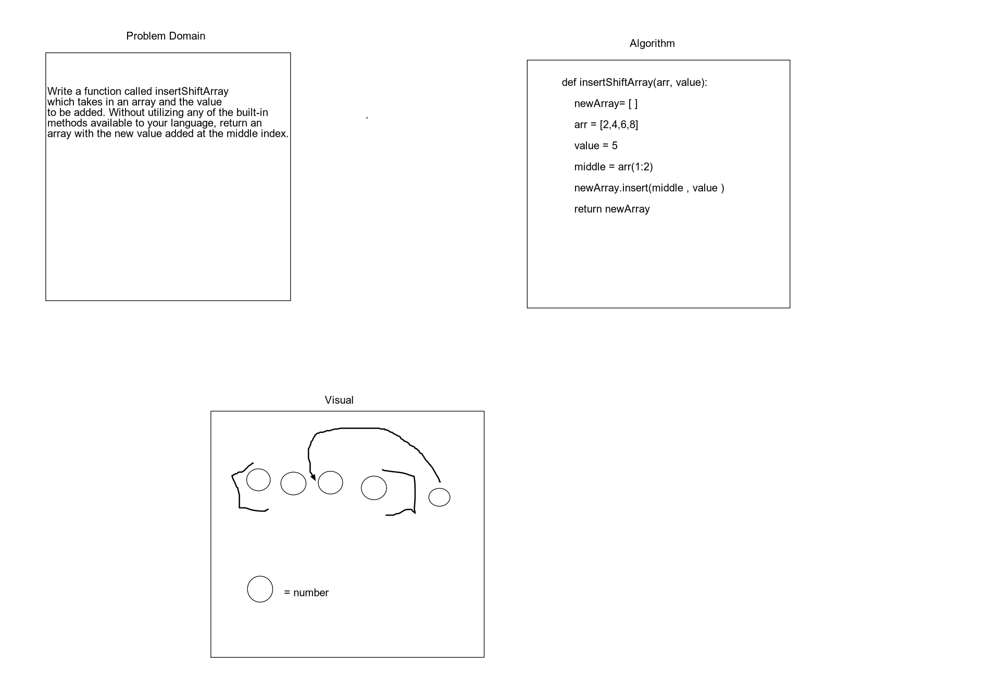

## Table of Contents
### See solution

# Challenge Summary
<!-- Short summary or background information -->
- Challenge Write a function called insertShiftArray which takes in an array and the value to be added. Without utilizing any of the built-in methods available to your language, return an array with the new value added at the middle index.

## Challenge Description
<!-- Description of the challenge -->
- Write a second function removeAndShiftArray that removes an element from the middle index and shifts other elements in the array to fill the new gap.

## Approach & Efficiency
<!-- What approach did you take? Why? What is the Big O space/time for this approach? -->
- We approached it by using a for loop to take each element of the array and then place it into a new array until the mid point is reached. Then using one built in function .append i appended the inserted argument into the new list, and then continued through the loop until the end of the array
- 

## Solution

