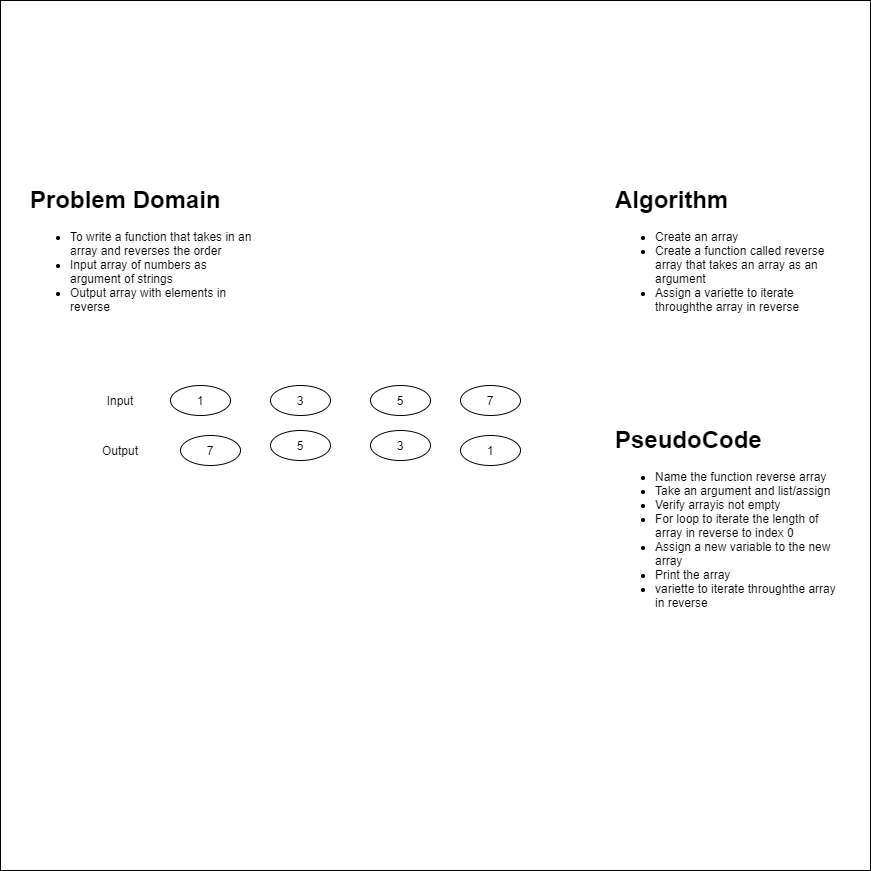

# Reverse an Array
A function to reverse an array given as an argument.
<!-- Short summary or background information -->

## Challenge
- Write a function called reverseArray which takes an array as an argument. Without utilizing any of the built-in methods available to your language, return an array with elements in reversed order.
<!-- Description of the challenge -->

## Approach & Efficiency
- I elected to use the for loop to iterate over the list and then make a new array and mutate it with appending the next number into it, until the for loop was completed. The original array was left unchanged. The second method was swapping the elements on the opposite ends of the list. I found this to be more efficient and taking up less memory without creating a new list.

- Both  both are inefficient due to selecting the for loop, which affects time in linear manner, and the efficiency is affected in a exponential manner. Both also uses up too much memory.

- The built in reverse() is a generator and saves time and is efficient.

- Specificiations used : gitignore, editorconfig
<!-- What approach did you take? Why? What is the Big O space/time for this approach? -->

## Solution

<!-- Embedded whiteboard image -->