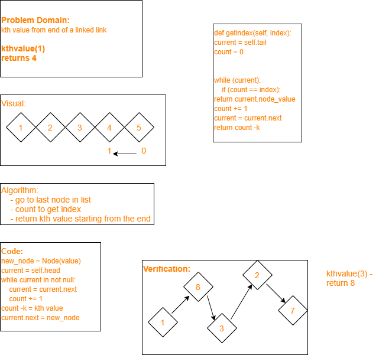
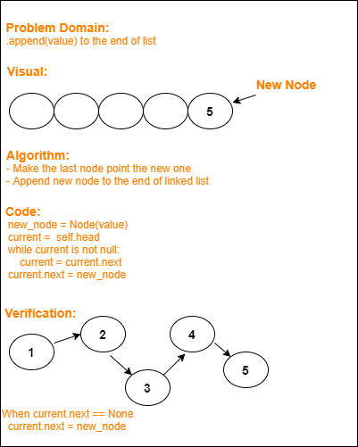

# Linked List

<<<<<<< HEAD
## Code Challenge #7
---
Link to PR:

Write a method for the Linked List class which takes a number, k, as a parameter. Return the node’s value that is k from the end of the linked list. You have access to the Node class and all the properties on the Linked List class as well as the methods created in previous challenges. k-th value from the end of a linked list.

## White Board
---

## Tests
---
1. Where k is greater than the length of the linked list
2. Where k and the length of the list are the same
3. Where k is not a positive integer
4. Where the linked list is of a size 1
5. “Happy Path” where k is not at the end, but somewhere in the middle of the linked list

## Code Challenge #6
---
Link to PR:
=======
## Code Challenge #6
---
Link to PR: 
>>>>>>> 63f910496224468a5fc76ef41e31877b7b5d6c5a

Write the following methods for the Linked List class:

- .append(value) which adds a new node with the given value to the end of the list
- .insertBefore(value, newVal) which add a new node with the given newValue immediately before the first value node
- .insertAfter(value, newVal) which add a new node with the given newValue immediately after the first value node

## White Board
---

<<<<<<< HEAD

=======
>>>>>>> 63f910496224468a5fc76ef41e31877b7b5d6c5a

## Tests
---
1. Can successfully add a node to the end of the linked list
2. Can successfully add multiple nodes to the end of a linked list
3. Can successfully insert a node before a node located i the middle of a linked list
4. Can successfully insert a node before the first node of a linked list
5. Can successfully insert after a node in the middle of the linked list
6. Can successfully insert a node after the last node of the linked list

<<<<<<< HEAD
=======

>>>>>>> 63f910496224468a5fc76ef41e31877b7b5d6c5a
## Code Challenge #5
---
Link to PR

### Description
---
- Create a Node class that has properties for the value stored in the Node, and a pointer to the next Node.

- Within your LinkedList class, include a head property. Upon instantiation, an empty Linked List should be created.

    - Define a method called insert which takes any value as an argument and adds a new node with that value to the head of the list with an O(1) Time performance.
    - Define a method called includes which takes any value as an argument and returns a boolean result depending on whether that value exists as a Node’s value somewhere within the list.
    - Define a method called toString (or str in Python) which takes in no arguments and returns a string representing all the values in the Linked List, formatted as: "{ a } -> { b } -> { c } -> NULL"
- Any exceptions or errors that come from your code should be semantic, capturable errors. For example, rather than a default error thrown by your language, your code should raise/throw a custom, semantic error that describes what went wrong in calling the methods you wrote for this lab.

### Tests
---
1. Can successfully instantiate an empty linked list
2. Can properly insert into the linked list
3. The head property will properly point to the first node in the linked list
4. Can properly insert multiple nodes into the linked list
5. Will return true when finding a value within the linked list that exists
6. Will return false when searching for a value in the linked list that does not exist
7. Can properly return a collection of all the values that exist in the linked list
### Usage
---
Begin by creating a new LinkedList:

    ll = LinkedList()
Then insert some values into your LinkedList

    ll.insert('Saturday')
    ll.insert('Friday')
    ll.insert('Thursday')
    ll.insert('Wednesday')
    ll.insert('Tuesday')
    ll.insert('Monday')
    ll.insert('Sunday')
Then print the head value

    print(ll.head)
returns: Sunday, Next_Node=Monday, Next_Node=Tuesday, Next_Node=Wednesday, Next_Node=Thursday, Next_Node=Friday, Next_Node=Saturday, Next_Node=None

### Challenges
---
Test writing is always challenging/confusing.

### Author
---
Bhagirath Bhatt