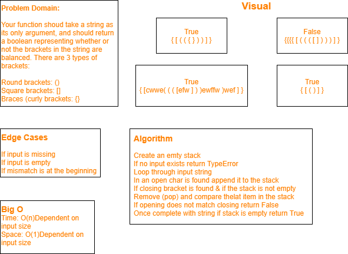

# Challenge Summary
### Multi-Bracket-Validation

## Challenge Description
​Your function should take a string as its only argument, and should return a boolean representing whether or not the brackets in the string are balanced. There are 3 types of brackets:

Round Brackets : () Square Brackets : [] Curly Brackets : {}

## Approach & Efficiency
​Create an an empty stack If no input exists return TypeError Loop through input string If an opening char is found append it to the stack If closing bracket is found & If the stack is not empty Remove (pop) and compare the last item in the stack If opening does not does not match closing return False Once complete with string if stack is empty return True

​Time: O(n) Dependent on size of input Space: O(1) Dependent on size of input

## Solution
